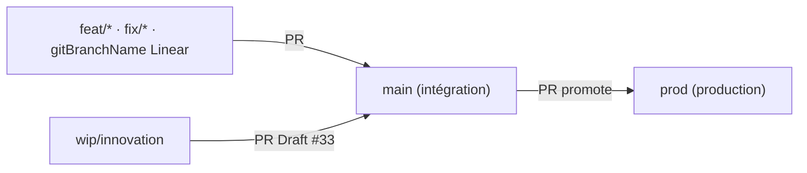

# ADR : Option C — `main` = intégration, `prod` = production

| | |
| --- | --- |
| **Statut** | Accepté (figé) |
| **Date** | 2026-08-26 |
| **Ticket** | [AXE-319](https://linear.app/axel-project/issue/AXE-319) |
| **Projet** | [Axel Job — Déploiement prod](https://linear.app/axel-project/project/axel-job-deploiement-prod-branche-prod-cd-7a2f9ce7e5ed) |

Décision d’architecture Git : les agents et l’équipe **ne traitent plus `main` comme la production**.

Runbook quotidien : [`git-workflow.md`](git-workflow.md) · protections : [`branch-protections.md`](branch-protections.md) · serveur : [`deploy.md`](deploy.md).

---

## Contexte

Jusqu’ici la doc du repo disait **`main` = prod** (pas de branche `prod` dédiée, contrairement au CRM / WhatsApp Inbox). Conséquences :

- Merger une PR dans `main` était lu comme « c’est en prod ».
- Le serveur se mettait à jour avec `git pull origin main`.
- Un agent pouvait croire qu’un merge `main` déclenchait le déploiement.

Le chantier [Déploiement prod](https://linear.app/axel-project/project/axel-job-deploiement-prod-branche-prod-cd-7a2f9ce7e5ed) aligne AxeL Job sur le modèle CRM : **intégration ≠ production**.

`origin/prod` existe déjà. Au moment de cette ADR elle est **en retard** sur `origin/main` : le premier promote `main` → `prod` (PR dédiée) rattrape l’écart.

---

## Décision (Option C)

| Branche | Rôle | Comment on y arrive |
| --- | --- | --- |
| **`main`** | Intégration. Code revu, CI verte, **pas** déployé en production. | PR feature / fix / `wip/innovation` → `main` |
| **`prod`** | Production. C’est **la seule** branche que le serveur (ou le CD) checkout. | PR **promote** `main` → `prod` (ou hotfix depuis `prod`) |
| **`wip/innovation`** | Chantier long éditeur Beta (PR Draft [#33](https://github.com/presidentaxel/Axeljob/pull/33)). | Ne merge **pas** tant que non prêt ; jamais directement vers `prod` |



**Ne jamais** `git push origin main` ni `git push origin prod`. Toute intégration **et** toute mise en production passent par une Pull Request.

### Runbook — promote `main` → `prod`

```bash
gh pr create --base prod --head main \
  --title "release: promote main → prod" \
  --body "$(cat <<'EOF'
## Summary
Promote intégration (`main`) vers production (`prod`).

## Linear
Fixes AXE-XX

## Test plan
- [ ] CI verte sur cette PR
- [ ] Après merge : CD auto (AXE-317) **ou** fallback serveur `docs/deploy.md`
- [ ] `curl …/health` → ok
EOF
)"
```

Titre / body : garder `Fixes AXE-XX` si un ticket Linear suit cette release. Ne pas y coller des features isolées : le promote emporte **tout** `main` qui n’est pas déjà dans `prod`.

### Runbook — hotfix prod

1. Brancher depuis **`origin/prod`** (pas depuis `main`) :  
   `git fetch origin && git checkout -b hotfix/<sujet> origin/prod`
2. Fix minimal + tests + CI locale.
3. PR **vers `prod`** → merge → deploy (CD ou fallback).
4. **Backport** vers `main` : cherry-pick (ou PR `hotfix/…` → `main`) pour que le correctif ne disparaisse pas au prochain promote.

---

## Conséquences

Pour les **agents** :

- Une PR feature se base sur `main` et cible `main`. Ce n’est **pas** un déploiement.
- Un merge dans `main` ne justifie **pas** un `git pull` sur le serveur de production.
- La prod se met à jour uniquement après merge d’une PR dont la base est `prod`.
- Push direct vers `main` **et** `prod` : interdit (hooks + `scripts/guard-push-via-pr.sh`).

Pour le **serveur** : checkout `prod`, `git pull origin prod`. Plus de `git pull origin main` en production. Détail : [`deploy.md`](deploy.md).

Pour le **chantier** : cette ADR fige **Option C**. Les tickets suivants livrent le câblage GitHub ; tant qu’ils ne sont pas mergés, le **comportement Git reste Option C**, le **déploiement auto** pas encore.

| Ticket | Rôle | État au moment de l’ADR |
| --- | --- | --- |
| [AXE-316](https://linear.app/axel-project/issue/AXE-316) | CI sur les PR vers `prod` | In Review — [PR #168](https://github.com/presidentaxel/Axeljob/pull/168) |
| [AXE-317](https://linear.app/axel-project/issue/AXE-317) | CD `deploy-prod.yml` sur `push` à `prod` seulement | Todo |
| [AXE-318](https://linear.app/axel-project/issue/AXE-318) | Branch protection GitHub `main` + `prod` (Settings) | Todo — clics humains |
| [AXE-319](https://linear.app/axel-project/issue/AXE-319) | Cette ADR + runbook + garde-fous locaux | Ce document |
| [AXE-320](https://linear.app/axel-project/issue/AXE-320) | Smoke E2E promote + hotfix/backport | Backlog — bloqué par 316–319 |

### Fallback jusqu’à AXE-317

Le workflow CD n’existe pas encore. Après merge de la PR promote dans `prod` :

1. Sur le serveur : `git fetch origin && git checkout prod && git pull origin prod`
2. `docker compose build && docker compose up -d`
3. Vérifier `/health`

Si le CD est down plus tard : **même fallback**, toujours depuis `prod`, jamais depuis `main`.

### Protections GitHub (AXE-318)

Les hooks locaux bloquent déjà `main` / `master` / `prod` sur une machine configurée. GitHub Settings n’est **pas** encore coché : un admin peut encore pousser en urgence. Checklist : [`branch-protections.md`](branch-protections.md).

---

## Alternatives non retenues

| Option | Idée | Pourquoi pas |
| --- | --- | --- |
| **A** — `main` = prod | Statu quo. Simple. | Un merge d’intégration = mise en prod. Pas de filet, pas d’alignement CRM. |
| **B** — Git Flow (`develop` + `main`) | `develop` intégration, `main` prod. | Trois lignes de vie (`develop` / `main` / `wip/innovation`). Plus lourd que le besoin. |
| **C** — `main` + `prod` | **Retenu.** Même vocabulaire que le CRM. | — |

Ne pas réintroduire « `main` = prod » dans la doc, les règles Cursor, ou les scripts.
