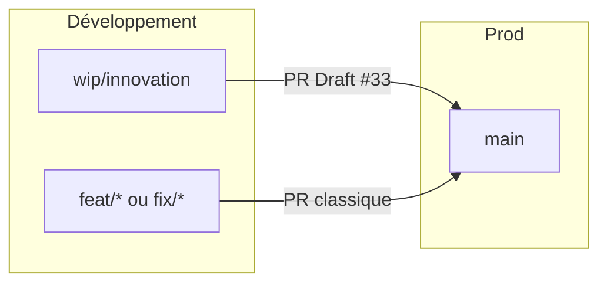

# Workflow Git et Pull Requests

Guide de référence pour ne pas se perdre entre **`main`** (prod), les branches de feature et le gros chantier **`wip/innovation`**.

## Vue d'ensemble



| Branche | Rôle | Merge en prod |
| --- | --- | --- |
| **`main`** | Production. Déployée. | - |
| **`wip/innovation`** | Éditeur Beta, import PDF canvas, score ATS - **dev actif** | **Non** pour l'instant (PR en **Draft**) |
| **`feat/*`**, **`fix/*`** | Petites évolutions ou correctifs isolés | Via PR quand prêt |

> [!IMPORTANT]
> **Ne jamais** `git push origin main`. Toute intégration passe par une **Pull Request**. Les hooks Git (`.githooks/pre-push`) et Cursor (`.cursor/hooks.json`) bloquent les push directs vers `main` / `master`.

---

## PR Draft `wip/innovation` → `main`

Le chantier innovation est suivi par une **PR en brouillon (Draft)** :

- **PR ouverte** : [#33 - WIP: éditeur Beta, import PDF canvas et score ATS](https://github.com/presidentaxel/Axeljob/pull/33)
- **Statut** : Draft - **ne pas merger** tant que l'éditeur Beta / l'import PDF ne sont pas prêts pour la prod
- **But** : visibilité (diff, CI GitHub, commentaires) **sans** risque de mise en prod accidentelle

### Pourquoi une Draft PR et pas merge direct ?

- Tu **continues à développer** sur `wip/innovation` : chaque `git push` **met à jour la PR automatiquement**
- `main` reste stable (prod)
- La CI tourne sur la branche à chaque push
- Quand ce sera prêt : passer la PR en **Ready for review** → review → merge

---

## Flux au quotidien sur `wip/innovation`

```bash
git checkout wip/innovation
git pull origin wip/innovation   # récupérer le travail des autres si besoin

# … coder …

git add .
git commit -m "feat(import): …"

bash scripts/pre-push.sh --skip-extras --skip-gitleaks
git push origin wip/innovation   # met à jour la PR Draft #33
```

**Pas besoin** de recréer une PR à chaque commit : une seule PR Draft suit toute la branche.

---

## Petites évolutions (hors gros chantier innovation)

Pour un correctif ou une feature **ciblée** et **mergeable rapidement** :

```bash
git checkout main
git pull origin main
git checkout -b fix/mon-sujet    # ou feat/mon-sujet

# … coder, commit …

bash scripts/pre-push.sh --skip-extras --skip-gitleaks
git push -u origin HEAD
gh pr create --base main --title "fix: …" --body "…"
```

Merger la PR une fois la CI verte et la review OK.

> [!TIP]
> Le hotfix PDF Safari a suivi ce flux (`hotfix/pdf-export` → PR/merge → branche supprimée). Réserver `wip/innovation` au chantier long.

---

## Mettre innovation en prod (plus tard)

Quand le chantier est prêt :

1. Vérifier que la CI est verte sur la PR #33
2. Sur GitHub : **Ready for review** (retirer le statut Draft)
3. Review + validation explicite
4. **Merge** la PR dans `main`
5. Déploiement selon `docs/deploy.md`

---

## CI locale avant push ou PR

Depuis la racine du dépôt :

```bash
bash scripts/pre-push.sh --skip-extras --skip-gitleaks
```

Équivalent CI GitHub : ruff, **black 24.10.0**, mypy, pytest+couverture, `npm ci`, lint, build, `test:unit`.

Ne pousser / ouvrir une PR que si la commande se termine par `OK - pre-push terminé sans erreur.`

Setup hooks (une fois par clone) :

```bash
bash scripts/setup-dev.sh
# ou : bash scripts/install-git-hooks.sh
```

Contournement urgence uniquement : `SKIP_PREPUSH=1 git push`.

---

## Références

| Document | Contenu |
| --- | --- |
| `docs/COMMANDS.md` | Aide-mémoire commandes (section Git) |
| `docs/contributing.md` | Quality gates, checklist PR |
| `docs/branch-protections.md` | Garde-fous locaux + checklist branch protection GitHub |
| `docs/linear-github-workflow.md` | Linear ↔ GitHub (projet `Axel Job`, issues `AxelJob`, 1 ticket = 1 PR) |
| `.cursor/rules/pre-push-ci.mdc` | Règle agent Cursor (PR-first) |
| `scripts/guard-push-via-pr.sh` | Blocage push direct vers `main` |

---

## FAQ

**Je suis sur `wip/innovation`, je push, est-ce que ça part en prod ?**  
Non. Un push sur `wip/innovation` ne touche pas `main`. Même après **merge de la PR** vers `main` (ou un push direct interdit), le **déploiement serveur** reste une étape séparée ([`deploy.md`](deploy.md)). La PR #33 est en **Draft**.

**Je dois ouvrir une nouvelle PR à chaque commit ?**  
Non sur `wip/innovation` : la PR #33 existe déjà et se met à jour à chaque push.

**Je veux merger un petit fix sans attendre innovation ?**  
Branche `fix/*` depuis `main`, PR classique, merge indépendamment de #33.

**L'agent Cursor peut-il push sur `main` ?**  
Non - règle `.cursor/rules/pre-push-ci.mdc` + hooks.
