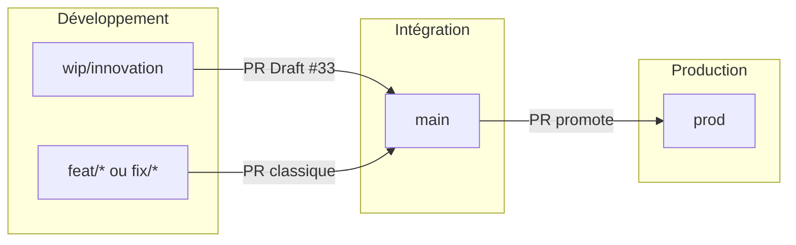

# Workflow Git et Pull Requests

Guide de référence pour ne pas se perdre entre **`main`** (intégration), **`prod`** (production), les branches de feature et le gros chantier **`wip/innovation`**.

Décision figée : [`ADR_MAIN_PROD.md`](ADR_MAIN_PROD.md) (Option C). Protections : [`branch-protections.md`](branch-protections.md). Serveur : [`deploy.md`](deploy.md).

## Vue d'ensemble



| Branche | Rôle | En production ? |
| --- | --- | --- |
| **`main`** | Intégration. Code revu, CI verte. | **Non.** Un merge dans `main` ne déploie pas. |
| **`prod`** | Production. Cible du serveur / du CD. | **Oui**, après merge d’une PR dont la base est `prod`. |
| **`wip/innovation`** | Éditeur Beta, import PDF canvas, score ATS — **dev actif** | **Non** (PR en **Draft**) |
| **`feat/*`**, **`fix/*`**, `gitBranchName` Linear | Petites évolutions ou correctifs isolés | Via PR vers `main`, puis **promote** `main` → `prod` |

> [!IMPORTANT]
> **Ne jamais** `git push origin main` ni `git push origin prod`. Toute intégration **et** toute mise en production passent par une **Pull Request**. Les hooks Git (`.githooks/pre-push`) et Cursor (`.cursor/hooks.json`) bloquent les push directs vers `main` / `master` / `prod`.

> [!WARNING]
> Merger dans `main` **n’est pas** une mise en prod. Les agents ne doivent pas `git pull origin main` sur le serveur, ni traiter une PR vers `main` comme un déploiement.

---

## PR Draft `wip/innovation` → `main`

Le chantier innovation est suivi par une **PR en brouillon (Draft)** :

- **PR ouverte** : [#33 - WIP: éditeur Beta, import PDF canvas et score ATS](https://github.com/presidentaxel/Axeljob/pull/33)
- **Statut** : Draft — **ne pas merger** tant que l'éditeur Beta / l'import PDF ne sont pas prêts pour l’intégration (`main`)
- **But** : visibilité (diff, CI GitHub, commentaires) **sans** risque de promote accidentel vers `prod`

### Pourquoi une Draft PR et pas merge direct ?

- Tu **continues à développer** sur `wip/innovation` : chaque `git push` **met à jour la PR automatiquement**
- `main` reste l’intégration stable ; `prod` n’est pas touchée
- La CI tourne sur la branche à chaque push
- Quand ce sera prêt : passer la PR en **Ready for review** → review → merge dans **`main`** → **ensuite** un promote `main` → `prod` ([runbook](ADR_MAIN_PROD.md))

---

## Flux au quotidien sur `wip/innovation`

```bash
git checkout wip/innovation
git pull origin wip/innovation   # récupérer le travail des autres si besoin

# … coder …

git add .
git commit -m "feat(import): …"

bash scripts/pre-push.sh --skip-extras --skip-gitleaks
git push origin wip/innovation   # met à jour la PR Draft #33
```

**Pas besoin** de recréer une PR à chaque commit : une seule PR Draft suit toute la branche.

---

## Petites évolutions (hors gros chantier innovation)

Pour un correctif ou une feature **ciblée** et **mergeable rapidement dans `main`** :

```bash
git checkout main
git pull origin main
git checkout -b fix/mon-sujet    # ou feat/mon-sujet, ou le gitBranchName Linear

# … coder, commit …

bash scripts/pre-push.sh --skip-extras --skip-gitleaks
git push -u origin HEAD
gh pr create --base main --title "fix: …" --body "…"
```

Merger la PR une fois la CI verte et la review OK. **Ça n’arrive pas en production** tant qu’on n’a pas ouvert / mergé une PR `main` → `prod`.

> [!TIP]
> Le hotfix PDF Safari a historiquement ciblé `main` quand `main` était encore la prod. Aujourd’hui : fix d’intégration → `main` ; **urgence prod** → brancher depuis `origin/prod` (section hotfix).

---

## Promote `main` → `prod`

Quand l’intégration est prête à aller en production :

```bash
gh pr create --base prod --head main \
  --title "release: promote main → prod" \
  --body "…"
```

Détail (titre, body, fallback CD) : [`ADR_MAIN_PROD.md`](ADR_MAIN_PROD.md) et [`deploy.md`](deploy.md).

Cette PR emporte **tout** `main` qui n’est pas déjà dans `prod`. Ne pas y coller un correctif isolé « par-dessus » : soit il est déjà dans `main`, soit c’est un hotfix depuis `prod`.

Jusqu’à [AXE-317](https://linear.app/axel-project/issue/AXE-317) (CD), le merge dans `prod` **ne déploie pas tout seul** : enchaîner le fallback serveur (`git pull origin prod` + Docker) décrit dans [`deploy.md`](deploy.md).

---

## Hotfix production

Prod cassée, le fix ne peut pas attendre le prochain promote :

1. `git fetch origin && git checkout -b hotfix/<sujet> origin/prod`
2. Fix minimal + tests
3. PR **vers `prod`** → merge → deploy (CD ou fallback)
4. **Backport** vers `main` (cherry-pick / PR) pour ne pas perdre le correctif au promote suivant

Documenter dans Linear ([`linear-github-workflow.md`](linear-github-workflow.md)).

---

## Mettre innovation en prod (plus tard)

Quand le chantier est prêt :

1. Vérifier que la CI est verte sur la PR #33
2. Sur GitHub : **Ready for review** (retirer le statut Draft)
3. Review + validation explicite
4. **Merge** la PR dans **`main`** (intégration)
5. **Promote** `main` → `prod` (runbook ci-dessus)
6. Déploiement selon `docs/deploy.md`

---

## CI locale avant push ou PR

Depuis la racine du dépôt :

```bash
bash scripts/pre-push.sh --skip-extras --skip-gitleaks
```

Équivalent CI GitHub : ruff, **black 24.10.0**, mypy, pytest+couverture, `npm ci`, lint, build, `test:unit`.

Ne pousser / ouvrir une PR que si la commande se termine par `OK - pre-push terminé sans erreur.`

Setup hooks (une fois par clone) :

```bash
bash scripts/setup-dev.sh
# ou : bash scripts/install-git-hooks.sh
```

Contournement urgence uniquement : `SKIP_PREPUSH=1 git push`.

---

## Références

| Document | Contenu |
| --- | --- |
| [`ADR_MAIN_PROD.md`](ADR_MAIN_PROD.md) | Décision Option C (`main` ≠ prod) + runbook promote / hotfix |
| `docs/COMMANDS.md` | Aide-mémoire commandes (section Git) |
| `docs/contributing.md` | Quality gates, checklist PR |
| `docs/branch-protections.md` | Garde-fous locaux + checklist branch protection GitHub |
| `docs/linear-github-workflow.md` | Linear ↔ GitHub (projet `Axel Job`, issues `AxelJob`, 1 ticket = 1 PR) |
| `.cursor/rules/pre-push-ci.mdc` | Règle agent Cursor (PR-first, `main` et `prod` protégés) |
| `scripts/guard-push-via-pr.sh` | Blocage push direct vers `main` / `master` / `prod` |

---

## FAQ

**Je suis sur `wip/innovation`, je push, est-ce que ça part en prod ?**  
Non. Un push sur `wip/innovation` ne touche ni `main` ni `prod`. Même après **merge de la PR #33** vers `main`, il reste un **promote** `main` → `prod` puis le **déploiement serveur** ([`deploy.md`](deploy.md)). La PR #33 est en **Draft**.

**Je dois ouvrir une nouvelle PR à chaque commit ?**  
Non sur `wip/innovation` : la PR #33 existe déjà et se met à jour à chaque push.

**Je veux merger un petit fix sans attendre innovation ?**  
Branche `fix/*` depuis `main`, PR classique vers `main`, merge indépendamment de #33. Pour que ça arrive **en prod** : promote `main` → `prod` (ou hotfix depuis `prod` si urgence).

**L'agent Cursor peut-il push sur `main` ou `prod` ?**  
Non — règle `.cursor/rules/pre-push-ci.mdc` + hooks.

**Un merge dans `main`, c’est la prod ?**  
Non. `main` = intégration. La prod = branche `prod`.
